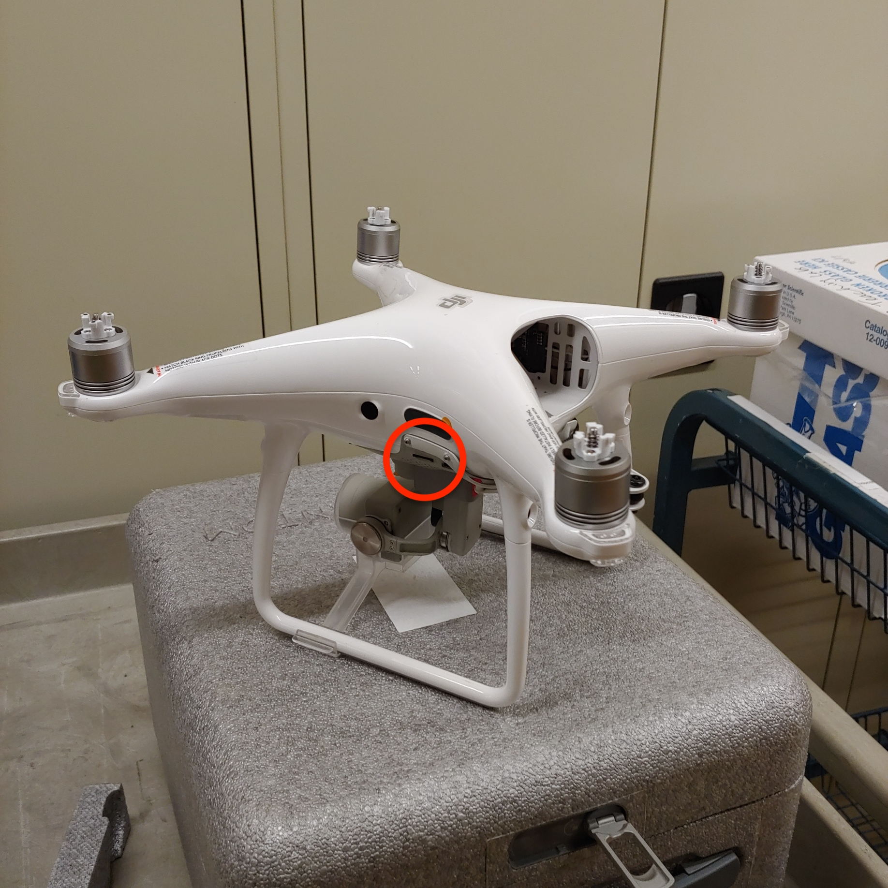
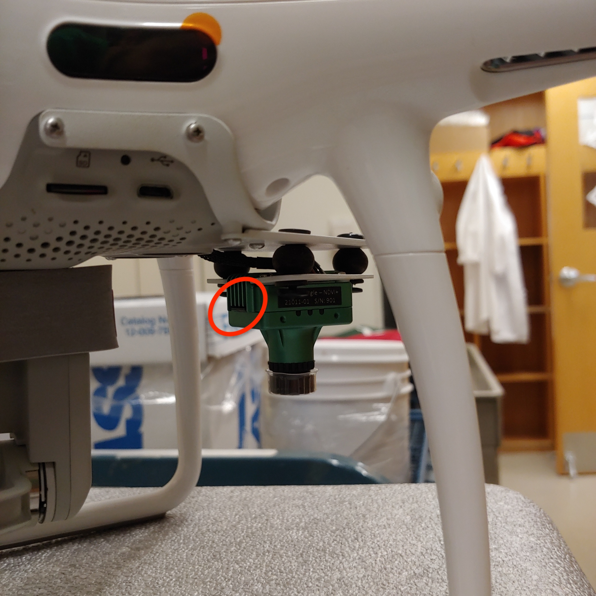
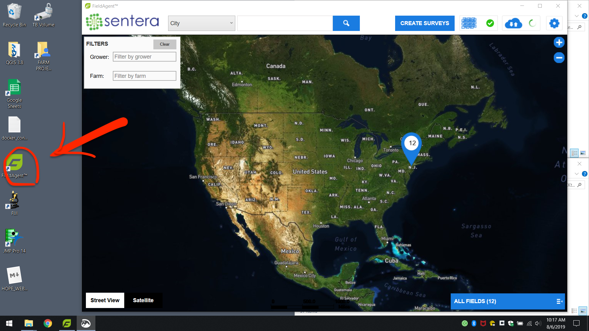
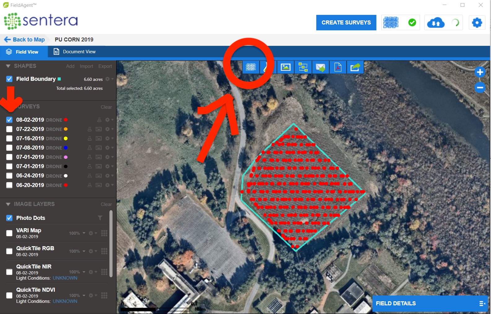
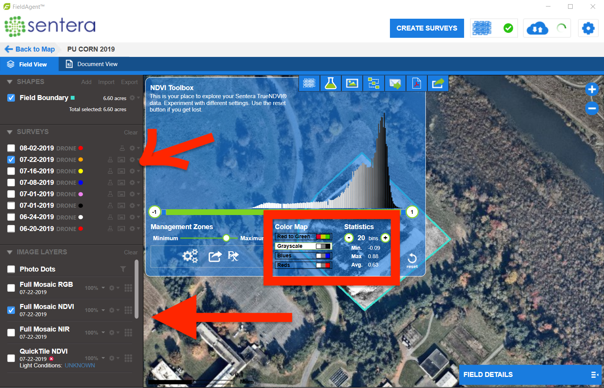
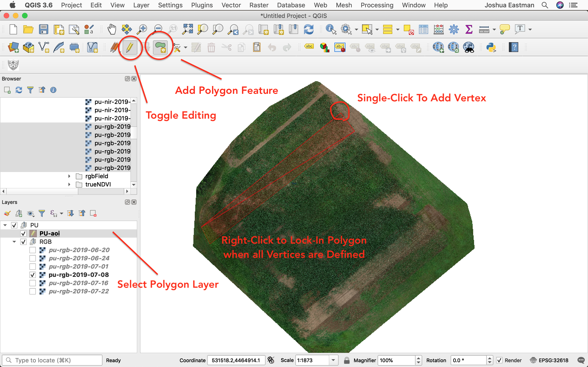

# FARM PROJECT 2019 ~ Joshua Eastman

This repository holds an annotated copy of the scripts and workflows that I put together for the PEI 2019 Farm Project. This README file will give you a detailed overview of the work. All files and folders referenced here are within this repository. To access and use the code, simply download this repository as a zip file and follow the steps below for installing python and necessary python modules.

I wish you well!

## Table of Contents

- [FARM PROJECT 2019 ~ Joshua Eastman](#farm-project-2019--joshua-eastman)
  - [Table of Contents](#table-of-contents)
  - [Project Arms](#project-arms)
  - [DRONE](#drone)
    - [FieldAgent](#fieldagent)
      - [Image Import](#image-import)
      - [NDVI Mosaic Output](#ndvi-mosaic-output)
    - [Construct Shapefiles to Define Areas of Interest (AOI)](#construct-shapefiles-to-define-areas-of-interest-aoi)
      - [Setting Up the Workspace](#setting-up-the-workspace)
      - [Creating the AOI file](#creating-the-aoi-file)
      - [Building the Polygons on the AOI](#building-the-polygons-on-the-aoi)
    - [Using Python for Bulk GeoTIFF Processing](#using-python-for-bulk-geotiff-processing)
      - [Reguired Python Modules](#reguired-python-modules)
      - [Folder Structure](#folder-structure)
      - [Running geoProcessing.py](#running-geoprocessingpy)
      - [Outputs](#outputs)
        - [Folder After Running](#folder-after-running)
        - [Descriptions](#descriptions)
      - [Test Using This Repository](#test-using-this-repository)
  - [ARABLE](#arable)
    - [Getting the Data](#getting-the-data)
      - [Limitations](#limitations)
    - [Handling the Data](#handling-the-data)

## Project Arms

1. [Drone Data](##DRONE)
2. [Arable Sensor Data](##ARABLE)
3. Other Data
    - Bugs
    - Soil Nutrients
    - Camera Traps
4. General Processing

<!-- TODO: Add outline at top of README -->

<!-- TODO: Add Stitching Troubleshooting Section -->

<!-- TODO: Add section on naming conventions -->

<!-- TODO: Add GIS CRS Troubleshooting Section -->

Each of these project arms were approached somewhat differently due to differences in the data structures. The Arable Sensor and Drone Imagery data wrangling applications presented in this repository are built around the Arable and FieldAgent specifications, respectively. Bug, soil nutrient, and camera trap data are all held in spreadsheets and so are handled much more simply. We will begin our overview with a detailed description of Arable data handling.

## DRONE

**Drone image processing and data extraction** is the big ticket item. This section describes how to use a GIS application to define areas of interest (AOI) and then use these areas with Sentera FieldAgent NDVI exports to extract matrices of NDVI values. Once you have an extracted NDVI value matrix, you can perform all the numerical analysis you want, such as distribution fitting and differentials over time. Ok, let's get started:

*What you need:*

1. [QGIS](https://qgis.org/en/site/)
2. [Sentera FieldAgent Desktop](https://sentera.com/fieldagent-platform/)
3. The following Python modules:
    - [Rasterio](https://rasterio.readthedocs.io/en/stable/)
    - [Geopandas](http://geopandas.org/)
    - [Numpy](https://numpy.org/)

### FieldAgent

#### Image Import

Here is how structured my image import workflow, and it worked really well. The basic steps are:

1. Move RGB and NIR images to folder on computer
    - RGB: Create folders for each farm and date
    - NIR: Add farm name to snapshot folders after moving
2. Add images in bulk
    - Can add multiple farms at once, **but not multiple times**. So if any farm was flown over more than once between imports, you need to import each flight seperately.

After having successfully flown the drone at your farms for the week, you need to import the images from the two drone SD cards:

- From the side of the drone (RGB)

<p align="center">

</p>

- From the little green Sentera sensor (NIR)
  
<p align="center">

</p>

When I did this on the Lenovo laptop, I created a top-level folder on the TeraByte drive called "DRONE" and structured sub-folders like this:

```bash
D:
├── DRONE
│   ├── NIR_images
│        ├── PU-2019-08-02_20-06-13
│        ├── KKcorn-2019-08-02_19-03-35
│        ├── OO-2019-08-02_17-42-43
│        ├── BRF-2019-08-01_18-19-56
│        ├── KKtom-2019-07-26_18-56-46
│        ├── ...
│   ├── RGB_images
│        ├── PU-2019-08-02-RGB
│        ├── KKcorn-2019-08-02-RGB
│        ├── OO-2019-08-02-RGB
│        ├── BRF-2019-08-01-RGB
│        ├── KKtom-2019-07-26-RGB
│        ├── ...
└── (etc...)
```

The contents of each RGB child folder (`PU-2019-08-02-RGB`, etc.) are the images from the drone's RGB SD card (from its side). You will need to make each of these RGB folders and name them. The NIR folders (`PU-2019-08-02_20-06-13`, etc.) are the "Snapshots" folders from the NIR SD card with the farm name added to the front. The contents of these folders include all of the images and a bunch of metadata files. You don't need to worry about the metadata files.

**Make sure that you delete** the DCIM images (RGB SD card) and "Snapshots" sub-folders (NIR SD card) once you have moved everything onto the laptop's D: drive. This will keep those SD cards from filling up (16 and 32GB each, respectively) and will make it easier for you to figure out what you have imported already in the future.

After moving everything onto the computer and cleaning the SD cards, it's time to import the images as "Surveys" in the FieldAgent Desktop app.

<p align="center">
</br>
Launch FieldAgent Desktop Application
</p>

Once you're inside the applicaion, click the big blue "CREATE SURVEYS" button at the top. Click "Add" on the right of the white box, and **select the NIR and RGB folders** that you've migrated over to the computer. You can choose folders that correspond to multiple farms and the FieldAgent software will sort them out. What it can't sort out is time, so make sure that you only include one flight tops per farm. Go through the next steps (see [Sentera's Documentation](https://desk.zoho.com/portal/sentera/kb/articles/fieldagent-desktop-user-guide)for this) and everything will import properly to their respective farms.

#### NDVI Mosaic Output

Once the images have imported to their respective farms and dates, you can begin stitching them into RGB and NDVI mosaics.

> Quick side note: the "mosaic" is technically an orthorectified GeoTIFF. GeoTIFF is the file format (.tiff is the extension) which I'll discuss in more detail later, and "[orthorectified](https://trac.osgeo.org/ossim/wiki/orthorectification)" means that the constructed image accounts for the different perspectives of each of the images to create a true, flat image from all of them.

1. Launch FieldAgent Desktop
2. Click on the blue "All Fields" rectangle at the bottom-right of the screen
    - A list of all of the fields will pop up
3. Navigate to and click on the field you want to export
4. In the farm survey viewer, select the date you want to create a mosaic for, then click the blue button with a grid on it to add the selected survey to the stitching queue:

<p align="center">

</p>

If everything goes properly, it should take anywhere between 30 minutes and 4 hours for the survey to be stitched into RGB, NIR, and NDVI mosaics (depending on the number of photos). Once that's complete, you will see "Full Mosiac ___" options in the survey left sidebar.

<p align="center">

</p>

**To prepare the NDVI mosic for export**:

1. Select "Full Mosaic NDVI" in the left sidebar and allow it to load onto the map (see photo above)
2. Click on the "NDVI Toolbox" rectangle at the top-left corner of the map
3. Under "Statistics", increase bin size to max (20)
    - This is so that we have as granular detail as possible after exporting.
4. Under "Color Map", set to "Grayscale"
    - This is so that the NDVI values (which naturally have a range [-1, 1]) will be mapped to each raster layer of the exported GeoTIFF. More on this later.
    - **YOU MUST USE GRAYSCALE FOR MY BATCH GEOPROCESSING PYTHON APP TO WORK**: [geoProcessing.py](./drone/geoProcessing.py)
5. In the "Full Mosaic NDVI" row of the left sidebar, click the small grey settings wheel and select "Export"
6. Select the destination folder in the popup window
    - I recommend creating a folder specifically for your mosaic exports and naming each export with some convention that includes Farm, Date, and Type (RGB, NDVI, NIR, etc.)\

When the FieldAgent app exports the GeoTIFF to the destination folder, it gives it a generic name. **IMMEDIATELY NAVIGATE TO THE FOLDER AND NAME THE FILE ACCORDING TO YOUR CONVENTION**. You have to do all the grunt work of organizing and naming so that nothing is confused or falls through the cracks.

When doing analysis on Princeton corn field NDVI GeoTIFFs, this is what my output folder looked like after exporting everything I needed:

```bash
ortho
  ├── pu-ndvi-2019-06-20.tif
  ├── pu-ndvi-2019-06-24.tif
  ├── pu-ndvi-2019-07-01.tif
  ├── pu-ndvi-2019-07-08.tif
  ├── pu-ndvi-2019-07-16.tif
  ├── pu-ndvi-2019-07-22.tif
  ├── pu-nir-2019-06-20.tif
  ├── pu-nir-2019-06-24.tif
  ├── pu-nir-2019-07-01.tif
  ├── pu-nir-2019-07-08.tif
  ├── pu-nir-2019-07-16.tif
  ├── pu-nir-2019-07-22.tif
  ├── pu-rgb-2019-06-20.tif
  ├── pu-rgb-2019-06-24.tif
  ├── pu-rgb-2019-07-01.tif
  ├── pu-rgb-2019-07-08.tif
  ├── pu-rgb-2019-07-16.tif
  ├── pu-rgb-2019-07-22.tif
```

Notice that my naming convention allows you to clearly know the farm, the kind of mosaic, and the date. I recommend doing something similar.

### Construct Shapefiles to Define Areas of Interest (AOI)

When I say Areas of Interest (AOI), I really mean just that. What part of the farm do we care about? Obviously not the whole thing, because crops grow in rows and for some farms we're worried about one specific crop. For other farms, we run experiments on different sections and need to define these different sections in a way we can analyze them comparatively. That's why this next step is so important. Here we geographically define very precise sections that we care about and label them in such a way that we can handle and compare them easily later. I also think this process is really cool and am excited to share it with you.

For demonstration, I'll walk you through sectioning the PU corn field. Farm Project 2019 ran an experiment across eight sections of an ~4 acre cornfield. For more information on the experiment specifics, [check out my poster](./assets/EASTMAN_puCorn_poster_FINAL.pdf). The important thing presently is that we had eight sections defined on the ground that needed to be translated into a digital file that defined and sectioned the larger NDVI mosiac for section-by-section comparison.

I accomplished this using [QGIS](https://qgis.org/en/site/). Go ahead and install it to follow along.

#### Setting Up the Workspace

1. Launch QGIS
2. If you don't have a project specified for your Farm Project (or other) work, create a new project
    - Click the button at the top-left of the window, "New Project"
3. Go to Project > Properties
4. Designate a project home folder
    - Choose a close parent to the folder that contains the exported mosaics. This makes import and handling really easy.
5. In the "Browser" panel in the left sidebar of the main QGIS window, find your mosaics (should now be under Project Home) and drag them into the "Layers" panel (should be below the "Browser" panel)
    - Here I recommend being pretty anal about creating groups (little paperclip icon with green + in layers panel) for your layers. I would do this farm by farm, such that each group contains all the time-steps for one specific farm.
6. Display the RGB mosaic of the farm of interest on the map
    - If your map viewer gets all jacked up and everything dissapapears (this happened to me all the time as I was learning QGIS), right-click on a layer and select "Zoom to Layer." This should restore your view to something manageable.

#### Creating the AOI file

1. With an RGB mosaic of choice open on the display, click "New Shapefile Layer" in the top-left of the window
    - The icon looks like a little V with dots on it
2. In "Filename", click the box all the way to the right with three little dots to open a file browser. Navigate to where you want to store your shapefile and name it something conventional
    - I recommend that you save the shapefile layer in a sub-directory of the mosaic folder, or somewhere on the same level. This will make processing a little easier. But as long as you keep track of where you save everything, no worries.
3. Leave "File Encoding" as UTF-8
4. For "Geometry Type", select "Polygon"
5. Under "New Field," define a field name that matches your needs (like "Crop" or "Treatment Section")
    - This is to identify each polygon you create within the multipolygon layer so that you can differentiate later on as you process
6. Click "Add field"
7. Click "OK" to exit the window

Before the next step, make sure that snapping is turned on in QGIS. Do this by going to Project > Snapping Options and enabling "All Layers" and "Vertex and Segment" with the little magnet impressed. This will make the polygons cleanly nestled against each other if they need to be.

#### Building the Polygons on the AOI

Here's a short visual summary:

<p align="center">
</br>
Creating Polygon Layer in QGIS
</p>

1. Select the shapefile layer in the "Layer" panel
2. Click the little pencil near the top-left ("Toggle Editing")
3. Click the green blob with a little yellow star next to it ("Create Polygon Layer")
4. Visually identify the area of interest
    - It may be helpful to create a "Points" shapefule layer and define vertices first to make the polygon drawing easier. Google how to do this for instructions :P
5. Single-click each vertex in order. The polygon will automatically take shape
6. When you've finished defining one area of interest, right-click.
    - This will prompt you to enter data to the fields you've made. Increment integers for your IDs and use whatever label defines the polygon in the field you created when defining the shape
    - If you realize you want a label that you didn't make a field for, don't worry. Finish making your polygons and then add that field to the shapefile layer attribute table. Google "QGIS add field to shapefile attribute table" to see how to do this if you need to.
7. When you've finished creating polygons for all your areas of interest, click "Toggle Editing" again
    - Save when prompted

And that's it! If you took your time and defined your polygons well, then your analysis will be ON POINT! If not, then your numbers will lie, so make sure you define your AOIs very well.

### Using Python for Bulk GeoTIFF Processing

I wrote the [geoProcessing.py](./drone/geoProcessing.py) file to take all of the exported GeoTIFF files (RGB and NDVI) and:

1. Extract the NDVI values for each area of interest for every time step and write these to a new GeoTIFF
2. Write the NDVI value for *every* pixel to a csv file per AOI per flight date
3. Take the mean NDVI value per AOI per flight date and create one maste csv file holding those values
4. Crop the pseudo-NDVI Sentera output and export to new GeoTIFFs for every flight date
   1. By whole-field of interest
   2. By AOI
5. Crop the Sentera RGB output and export to new GeoTIFFs for every flight date
   1. By whole-field of interest
   2. By AOI

Lengthy descriptions of these outputs can be found under "[Outputs](#outputs)" down below.

I know that's a lot. Some of these outputs are used as intermediates steps for others, and you may find a use (either graphically, for presentation purposes, or numerically) for any one of them. The easist outputs to use for statistical analysis are the csv file that contains the mean NDVI value for each AOI for each time step and a BIG csv file that contains the NDVI file for every pixel per aoi per time step.

#### Reguired Python Modules

For [geoProcessing.py](./drone/geoProcessing.py) to run, you need to have an up-to-date Python environment installed. You also need the following modules:

- sys
- glob
- rasterio
- pandas
- numpy
- geopandas
- re
- datetime
- os

Before attempting to run [geoProcessing.py](./drone/geoProcessing.py), I would run

```bash
pip install [module]
```

for all of the above modules (e.g. `pip install rasterio`) to make sure you have installed, up-to-date versions. If any of these won't install, I'm afraid you won't be able to run [geoProcessing.py](./drone/geoProcessing.py). You'll need to troubleshoot on your own why any one of these modules wouldn't install. Ideally, you won't have any trouble running `pip install [module]` for any of the above modules.

#### Folder Structure

The program is a script named ["geoProcessing.py"](./drone/geoProcessing.py). In this repository, you'll find copies in [src](./src) and [drone](./drone). These are identical. I duplicated this [geoProcessing.py](./drone/geoProcessing.py) in this repository so that you could find it with all the other programs (in [src](./src)) and do a test run with it in correctly built folder (in [drone](./drone)).

For [geoProcessing.py](./drone/geoProcessing.py) to run, **it must be in a specific folder environement** and you must have certain files in place and properly named. This repository's [drone](./drone) folder is an example of everything you need for [geoProcessing.py](./drone/geoProcessing.py) to run properly and completely. Here's an outline of folder structure and required files:

**[drone](./drone):**

```bash
.
├── AOI # Folder containing shapefile and accessory files per farm that describes the areas of interest (AOI)
│   ├── PU_AOI.cpg
│   ├── PU_AOI.dbf
│   ├── PU_AOI.prj
│   ├── PU_AOI.qpj
│   ├── PU_AOI.shp
│   └── PU_AOI.shx
├── FIELD # Folder containing shapefile and accessory files per farm describing field to cookie-cut it out of messy Sentera export
│   ├── PU_field.cpg ## The FIELD files are OPTIONAL. The program will run without them. Everything else is necessary.
│   ├── PU_field.dbf
│   ├── PU_field.prj
│   ├── PU_field.qpj
│   ├── PU_field.shp
│   └── PU_field.shx
├── PU # Folder for each farm containing Sentera RGB and greyscale NDVI Full Mosaic exports
│   ├── PU_NDVI_2019_06_20.tif
│   ├── PU_NDVI_2019_06_24.tif
│   ├── PU_NDVI_2019_07_01.tif
│   ├── PU_NDVI_2019_07_08.tif
│   ├── PU_NDVI_2019_07_16.tif
│   ├── PU_NDVI_2019_07_22.tif
│   ├── PU_RGB_2019_06_20.tif
│   ├── PU_RGB_2019_06_24.tif
│   ├── PU_RGB_2019_07_01.tif
│   ├── PU_RGB_2019_07_08.tif
│   ├── PU_RGB_2019_07_16.tif
│   └── PU_RGB_2019_07_22.tif
└── geoProcessing.py # The program
```

The above folder structure has everything in place to run the full [geoProcessing.py](./drone/geoProcessing.py) for farm "PU". "PU" here is the farm name that the program uses to find all of its constituent shapefiles and output things to proper folders.

For clarity, your parent folder (that contains [geoProcessing.py](./drone/geoProcessing.py)) MUST have:

- An "AOI" folder
  - This folder MUST contain a farm_AOI.shp and accessory files for every farm that you run the program on
- A "FIELD" folder
  - This folder is *not* absolutely necessary. Put farm_field.shp and accessory files in here if you want to cut out a piece of the larger Sentera export for graphical use or whole-farm NDVI results
- A farm folder
  - for every farm that you want to process, you need to create a folder by the name of that farm (above, "PU") that contains all RGB and NDVI full mosaic exports from Sentera FieldAgent.
  - **NAMING CONVENTION MUST FOLLOW THE ABOVE PATTERN**: farm_RGB_YYYY_MM_DD.tif and farm_NDVI_YYY_MM_DD.tif respectively

#### Running [geoProcessing.py](./drone/geoProcessing.py)

To run [geoProcessing.py](./drone/geoProcessing.py):

1. Open terminal shell
    - MAC: "Terminal" application
    - WINDOWS: "Command Prompt" application
2. Navigate to the above directory
3. Run "python geoProcessing.py [farm]"

Here's how I do it in Terminal on my Mac:

```bash
Last login: Wed Aug  7 12:33:35 on ttys002
🌿 [joshua] % cd Github # cd sets current working directory and is used to navigate from one folder toa sub-folder
🌿 [Github] % cd JOSH-FARM-PROJECT-2019
🌿 [JOSH-FARM-PROJECT-2019] % cd drone
🌿 [drone] % ls # ls lists folder contents
AOI     FIELD     OUTPUTS     PU    geoProcessing.py
🌿 [drone] % python geoProcessing.py PU # RUN THE PROGRAM
```

Here is the program run command alone for clarity:

```bash
python geoProcessing.py PU
```

Where "PU" again is the farm name that I pass in as an argument and that the program uses to find all of the proper files and name all of the outputs.

#### Outputs

Running `python geoProcessing.py` in the correctly setup environment will produce many outputs. I briefly described them [above](#using-python-for-bulk-geotiff-processing). Here is a more detailed overview and an example of an output structure:

##### Folder After Running

```bash
.
├── AOI
│   ├── PU_AOI.cpg
│   ├── PU_AOI.dbf
│   ├── PU_AOI.prj
│   ├── PU_AOI.qpj
│   ├── PU_AOI.shp
│   └── PU_AOI.shx
├── FIELD
│   ├── PU_field.cpg
│   ├── PU_field.dbf
│   ├── PU_field.prj
│   ├── PU_field.qpj
│   ├── PU_field.shp
│   └── PU_field.shx
├── OUTPUTS
│   ├── NDVI_AOI_tiffs
│   │   └── PU
│   │       ├── PU_NDVI_ocf_cropped_2019-06-20.tif
│   │       ├── PU_NDVI_ocf_cropped_2019-06-24.tif
│   │       ├── PU_NDVI_shn_cropped_2019-07-16.tif
│   │       ├── ...
│   │       ├── PU_trueNDVI_ocf_2019-06-20.tif
│   │       ├── PU_trueNDVI_ocf_2019-06-24.tif
│   │       ├── PU_trueNDVI_ocf_2019-07-01.tif
│   │       ├── ...
│   ├── NDVI_Field_tiffs
│   │   └── PU
│   │       ├── PU0_trueNDVI_field_2019-06-20.tif
│   │       ├── PU0_trueNDVI_field_2019-06-24.tif
│   │       ├── PU0_trueNDVI_field_2019-07-01.tif
│   │       ├── ...
│   ├── NDVI_WholeField_tiffs
│   │   └── PU
│   │       ├── PU_trueNDVI_2019_06_20.tif
│   │       ├── PU_trueNDVI_2019_06_24.tif
│   │       ├── PU_trueNDVI_2019_07_01.tif
│   │       ├── ...
│   ├── NDVI_csv
│   │   └── PU
│   │       ├── PU_aoi_ndvi_ocf_2019-06-20.csv
│   │       ├── PU_aoi_ndvi_ocf_2019-06-24.csv
│   │       ├── PU_aoi_ndvi_ocf_2019-07-01.csv
│   │       ├── ...
│   │       └── PU_bigPapa.csv
│   ├── RGB_AOI_tiffs
│   │   └── PU
│   │       ├── PU_RGB_ocf_cropped_2019-06-20.tif
│   │       ├── PU_RGB_ocf_cropped_2019-06-24.tif
│   │       ├── PU_RGB_ocf_cropped_2019-07-01.tif
│   │       ├── ...
│   ├── RGB_Field_tiffs
│   │   └── PU
│   │       ├── PU0_rgb_field_2019-06-20.tif
│   │       ├── PU0_rgb_field_2019-06-24.tif
│   │       ├── PU0_rgb_field_2019-07-01.tif
│   │       ├── ...
│   └── mean_NDVI
│       └── PU_mean_ndvi.csv
├── PU
│   ├── PU_NDVI_2019_06_20.tif
│   ├── PU_NDVI_2019_06_24.tif
│   ├── PU_NDVI_2019_07_01.tif
│   ├── ...
│   ├── PU_RGB_2019_06_20.tif
│   ├── PU_RGB_2019_06_24.tif
│   ├── PU_RGB_2019_07_01.tif
│   ├── ...
└── geoProcessing.py
```

##### Descriptions

So what's in this folder? You will notice that in the top-level folder (where [geoProcessing.py](./drone/geoProcessing.py) resides) a new directory was created called "OUTPUTS." Every other output is nested in this "OUTPUTS" folder.

Within this "OUTPUTS" folder, you'll find:

- **mean_NDVI**
  - Contains one csv for each farm that you run the program on. Each csv contains three columns of data:
    - aoi
    - date
    - mean_ndvi
  - for each aoi, for each date, the mean-ndvi refers to the average NDVI value for all the pixels in the aois defined by the farm_AOI.shp file. For the PU example above, each "aoi" is the experimental section. For most farms, each "aoi" will be a row of a specific crop.
- **NDVI_AOI_tiffs**
  - This folder contains sub-directories for every farm. Within the subdirectory, you will find two kinds of files:
    - **pseudo-NDVI:** cropped grayscale pseudo-NDVI images (labeled "NDVI" in their names). These GeoTIFF files have RGBA bands and are basically cropped Sentera exports
    - **trueNDVI:** cropped true NDVI GeoTIFFS (labeled "trueNDVI" in their names). These GeoTIFF files have only 1 band with pixel range [-1, 1] corresponding to a true NDVI value
- **NDVI_csv**
  - This folder contains sub-folders for each farm you run this program on. Within each of thes sub-folders, you'll find two kinds of files:
    - A LONG list of csvs, one per AOI per date, each containing a single column of NDVI values for every single pixel in that AOI
    - A "farm_bigPapa.csv" that's an aggregate of all the other csvs. It contains three columns: "aoi","date","ndvi", and each row refers to a single pixel.
  - **The files in this folder will allow you to look at the NDVI values for any given AOI as a DISTRIBUTION rather than a single "mean" value given by the Arable Sensor or held in the mean_NDVI folder above. I think these are the most significant files output in this process. It's basically a population sample.**
- **NDVI_Field_tiffs**
  - Sub-folder for every farm containing trueNDVI [-1, 1] single-band GeoTIFFs defined by shapes in ./FIELD/farm_field.shp
  - These files are most useful for visualization, but could be further analyzed for whole-farm dynamics if the shape is defined well
- **NDVI_WholeField_tiffs**
  - Sub-folder for every farm containing Sentera FieldAgent NDVI exports converted to single-band trueNDVI [-1, 1] GeoTIFFs
- **RGB_AOI_tiffs**
  - Sub-folder for every farm containing Sentera RGB mosaics cropped per AOI per date. Useful for visualization to compare a single AOI over time side-by-side
- **RGB_Field_tiffs**
  - Sub-folder for every farm containing Sentera RGB mosaics cropped to the field perimeter defined by shapes in ./FIELD/farm_field.shp. Very useful for side-by-side visualizations. I used these in my end-of-summer poster presentation to illustrate how the field changed over time.

#### Test Using This Repository

This repository has all the files and directory structure built-in to test run [geoProcessing.py](./drone/geoProcessing.py). If you download the repository, navigate into the "drone" sub-directory and then run the [command](#running-geoprocessingpydronegeoprocessingpy):

```bash
python geoProcessing.py PU
```

If you have Python and the necessary modules properly installed, the process should complete and the [above output folder](#folder-after-running) will be produced, allowing you to see how everything works.

## ARABLE

The arable sensors are stationary UFO-shaped things on poles that stick up above crop canopies. They gather atmospheric and spectrometric data and report the data in two resolutions: daily and hourly.

- Link to the Arable website: [https://www.arable.com/](https://www.arable.com/)
- Link to our Arable portal: [https://princeton.arable.com/](https://princeton.arable.com/auth/(auth_view:login))
- Link to the Arable API documentation: [https://pro-soap.cloudvent.net/](https://pro-soap.cloudvent.net/)

I know that last link looks sketchy, and you'll be directed to a really sketchy-looking page that says "FREE PLAN," but that's actually the documentation page. Go ahead and click through the scary blue button and you'll land on the true Arable API documentation site. I used it to build my program, so I know it's the right stuff.

### Getting the Data

- File: [./src/ArableGrep.py](./src/ArableGrep.py)
- Function: Downloads all the hourly, daily, and health data from currently operational Arable sensors and outputs all data to csv files in the [arable_data](./arable_data) directory, labeled by sensor name and data type.

To run this program, navigate to the folder containing this repository using your terminal and run the following command:

```bash
python ./src/ArableGrep.py
```

This will create an "arable_data" directory within the parent directory (same level as "src") and create csv files containing hourly, daily, and health data for all of the sensors within that folder. If any of these csv files already exists, the program will intelligently download all of the most recent data (between the last sync and the present) and append it to the existing csv file.

After running this program, your "arable_data" directory should look something like this:

```bash
.
├── arable_data
│   ├── BRF\ Standard\ Tomato_daily.csv
│   ├── BRF\ Standard\ Tomato_health.csv
│   ├── BRF\ Standard\ Tomato_hourly.csv
│   ├── BRF\ Swiss\ Chard_daily.csv
│   ├── BRF\ Swiss\ Chard_health.csv
│   ├── BRF\ Swiss\ Chard_hourly.csv
│   ├── CG\ Cherry\ Tomato_daily.csv
│   ├── CG\ Cherry\ Tomato_health.csv
│   ├── CG\ Cherry\ Tomato_hourly.csv
│   ├── CG\ Standard\ Tomato_daily.csv
│   ├── ... (as many as you have)
└── src
    └── ArableGrep.py
```

#### Limitations

Three known bugs exist in this program:

- **THIS METHOD FOR GETTING THE DATA WORKS AS LONG AS THE SENSOR IS ON AND ACTIVELY REPORTING.** If the sensor is turned off or nonfunctional, THIS METHOD WILL NOT WORK because the sensor will not be in the list of active sensors accessed by this program. But as long as all sensors are on and active, this program will work great.
- When the program appends new data to old csv files, it sometimes adds a blank row between the old and new data.
- The program sometimes creates odd "_hourly", "_daily", and "_health" csv files with no sensor name labels. I believe these correspond to sensors that were operational but which for whatever reason are off or down. Disregard these files. If you can figure out a way to get sensor names for those sensors that are not currently operational, that would be ideal, because then the program could keep writing to those specific files.

### Handling the Data

Downloading the data into an accessible (csv) format is the biggest hurdle. Once it's in the csv format, you can do whatever you want with it. When I did my pretty basic analysis of the Princeton cornfield sensor data, I only used the "*_daily.csv" data and averaged data per drone flight week. I'll discuss that in more detail later.

However, early on in the summer I built a wrangling program with some handy functions that take arable csv files as inputs and output handy data objects. You're welcome to use these functions and dictionaries for your own programs.

- General Wrangling Program: [./src/ArableWrangle.py](./src/ArableWrangle.py)

Not all of the functions in [ArableWrangle](./src/ArableWrangle.py) may be useful to you. I would look through this script and identify things that are helpful, implementing only those aspects that are benificial. This program wasn't cleanly finished and packaged because my work shifted to Princeton cornfield only at the end of the 2019 Farm Project, which meant that handling *all* the Arable data was no longer important to me. Development of this program therefore ground to a halt.
