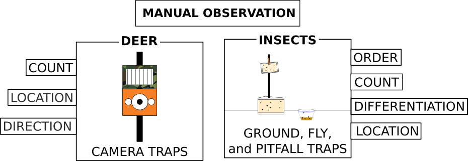
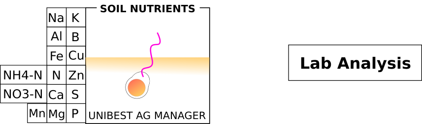
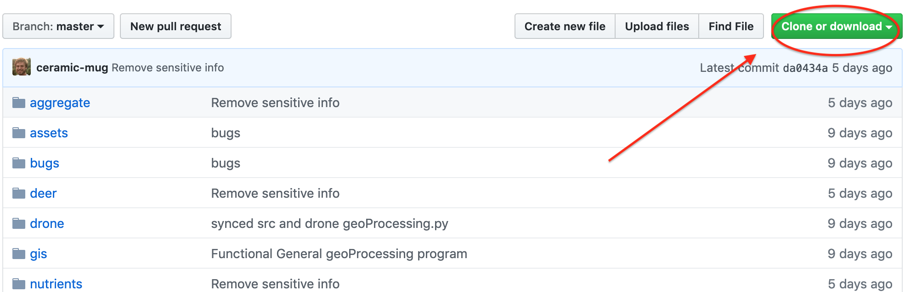

<!-- TODO: Add Stitching Troubleshooting Section -->

<!-- TODO: Add section on naming conventions -->

<!-- TODO: Add GIS CRS Troubleshooting Section -->

# WIKI

## Overview

This repository holds an annotated copy of the scripts (mini programs) and workflows that I developed during my time working with the PEI 2019 Farm Project. This README.md file will act as a detailed description, walkthrough, and troubleshooting guide for all the components of my work. All files and folders referenced here are within this repository. To access and use the code, simply [download this repository](#how-to-download-this-repository) as a zip file and [configure python](#configuring-python) appropriately.

I wish you well!

## Table of Contents

- [WIKI](#wiki)
  - [Overview](#overview)
  - [Table of Contents](#table-of-contents)
  - [DRONE](#drone)
    - [FieldAgent](#fieldagent)
      - [Image Import](#image-import)
      - [Mosaic Stitching](#mosaic-stitching)
      - [NDVI Mosaic Export](#ndvi-mosaic-export)
    - [Construct Shapefiles to Define Areas of Interest (AOI)](#construct-shapefiles-to-define-areas-of-interest-aoi)
      - [File Structure](#file-structure)
      - [Setting Up the Workspace](#setting-up-the-workspace)
      - [Creating an AOI file](#creating-an-aoi-file)
      - [Building the Polygons on the AOI](#building-the-polygons-on-the-aoi)
    - [Using Python for Bulk GeoTIFF Processing](#using-python-for-bulk-geotiff-processing)
      - [Reguired Python Modules](#reguired-python-modules)
      - [Required Folder Structure](#required-folder-structure)
      - [Running geoProcessing.py](#running-geoprocessingpy)
      - [Outputs](#outputs)
        - [Folder After Running](#folder-after-running)
        - [Descriptions](#descriptions)
      - [Test Using This Repository](#test-using-this-repository)
      - [Notes](#notes)
  - [ARABLE](#arable)
    - [Getting the Arable Sensor Data](#getting-the-arable-sensor-data)
      - [Limitations](#limitations)
    - [Handling the Data](#handling-the-data)
  - [BUGS, DEER, and NUTRIENTS](#bugs-deer-and-nutrients)
    - [BUGS](#bugs)
      - [Shannon Index](#shannon-index)
      - [Implementing Shannon Index](#implementing-shannon-index)
      - [My program: bugs.py](#my-program-bugspy)
        - [Folder structure for bugs.py](#folder-structure-for-bugspy)
        - [Running bugs.py](#running-bugspy)
        - [Folder after running](#folder-after-running)
        - [Test it yourself](#test-it-yourself)
      - [Note](#note)
    - [DEER](#deer)
      - [Implementing deer.py for Princeton corn field](#implementing-deerpy-for-princeton-corn-field)
    - [SOIL NUTRIENTS](#soil-nutrients)
  - [AGGREGATION & PROCESSING](#aggregation--processing)
    - [aggregate.py](#aggregatepy)
      - [Conditions](#conditions)
      - [Input Space](#input-space)
      - [Output space](#output-space)
      - [Interpreting the data in aggregate master CSVs](#interpreting-the-data-in-aggregate-master-csvs)
  - [How to download this Repository](#how-to-download-this-repository)
  - [Configuring Python](#configuring-python)

## DRONE

**Drone image processing and data extraction** was the big ticket item of my work. This section of my guide describes how to use a [GIS application](https://qgis.org/en/site/) to define areas of interest (AOIs) and then use these areas with [Sentera FieldAgent](https://sentera.com/fieldagent-platform/) NDVI exports to extract matrices of NDVI values. I also describe how I processed these matrices and convert NDVI and RGB Sentera outputs to a host of useful files defined according to your needs.

*What you need:*

1. [QGIS](https://qgis.org/en/site/)
2. [Sentera FieldAgent Desktop](https://sentera.com/fieldagent-platform/)
3. The following Python modules:
    - [Rasterio](https://rasterio.readthedocs.io/en/stable/)
    - [Geopandas](http://geopandas.org/)
    - [Numpy](https://numpy.org/)

### FieldAgent

[Sentera FieldAgent Desktop](https://sentera.com/fieldagent-platform/) is the software the Princeton Farm Project uses to process drone imagery. The software is proprietary (hence the funny name) and a bit of a black box. This walkthrough will detail the workflow that I developed to best handle image input from the drone micro SD cards and the best settings for FieldAgent exports. We export because as long as the data is stored in the FieldAgent app it's of no use to us.

#### Image Import

Here is how structured my image import workflow, and it worked really well. The basic steps are:

1. Move RGB and NIR images to respective independent folders on computer
    - RGB: Create folders for each farm and date
    - NIR: Add farm name to snapshot folder names after moving
2. Add images in bulk
    - Can add multiple farms at once, **but not multiple times**. So if any farm was flown over more than once between imports, you need to import each flight seperately.

Here are the details:

After having successfully flown the drone at your farms for the week, you need to import the images from the two drone SD cards:

- From the side of the drone (RGB)


- From the little green Sentera sensor (NIR)
  


When I did this on the Lenovo Farm Project laptop, I created a top-level folder on the TeraByte drive called "DRONE" and structured sub-folders like this:

```bash
D:
├── DRONE
│   ├── NIR_images
│        ├── PU-2019-08-02_20-06-13
│        ├── KKcorn-2019-08-02_19-03-35
│        ├── OO-2019-08-02_17-42-43
│        ├── BRF-2019-08-01_18-19-56
│        ├── KKtom-2019-07-26_18-56-46
│        ├── ...
│   ├── RGB_images
│        ├── PU-2019-08-02-RGB
│        ├── KKcorn-2019-08-02-RGB
│        ├── OO-2019-08-02-RGB
│        ├── BRF-2019-08-01-RGB
│        ├── KKtom-2019-07-26-RGB
│        ├── ...
└── (etc...)
```

The contents of each RGB child folder (`PU-2019-08-02-RGB`, etc.) are the images from the drone's RGB SD card. **You will need to make each of these RGB folders and name them appropriately**. The NIR folders (`PU-2019-08-02_20-06-13`, etc.) are from the "Snapshots" folder created automativally on the NIR SD card. You need to manually add the farm name to the front. The contents of the automatically made NIR folders include all of the images and a bunch of metadata files. You don't need to worry about the metadata files.

**Make sure that you delete** the DCIM images (RGB SD card) and "Snapshots" sub-folders (NIR SD card) once you have moved everything onto the laptop's D: drive. This will keep those SD cards from filling up (they are 16 and 32GB each, respectively) and will make it easier for you to figure out what you have imported already in the future.

After moving everything onto the computer and cleaning the SD cards, it's time to import the images as "Surveys" in the FieldAgent Desktop app.


Once you're inside the applicaion, click the big blue "CREATE SURVEYS" button at the top. Click "Add" on the right of the white box, and **select the NIR and RGB folders** that you've migrated over to the computer. **You can choose folders that correspond to multiple farms and the FieldAgent software will sort them out.** What it can't sort out is time, so make sure that you only include one flight tops per farm. Go through the next steps (see [Sentera's Documentation](https://desk.zoho.com/portal/sentera/kb/articles/fieldagent-desktop-user-guide) for detailed instructions) and everything will import properly to their respective farms.

#### Mosaic Stitching

Once the images have imported to their respective farms and dates, you can begin stitching them into RGB and NDVI mosaics.

> Quick side note: the "mosaic" is technically an orthorectified GeoTIFF. GeoTIFF is the file format (.tiff is the extension) which I'll discuss in more detail later, and "[orthorectified](https://trac.osgeo.org/ossim/wiki/orthorectification)" means that the constructed image accounts for the different perspectives of each of the images to create a true, flat image from all of them.

1. Launch FieldAgent Desktop
2. Click on the blue "All Fields" rectangle at the bottom-right of the screen
    - A list of all of the fields will pop up
3. Navigate to and click on the field you want to export
4. In the farm survey viewer, select the date you want to create a mosaic for, then click the blue button with a grid on it to add the selected survey to the stitching queue:


If everything goes properly, it should take anywhere between 30 minutes and 4 hours for the survey to be stitched into RGB, NIR, and NDVI mosaics (depending on the number of photos). Once that's complete, you will see "Full Mosiac ___" options in the survey left sidebar.


#### NDVI Mosaic Export

1. Select "Full Mosaic NDVI" in the left sidebar and allow it to load onto the map (see photo above)
2. Click on the "NDVI Toolbox" rectangle at the top-left corner of the map
3. Under "Statistics", increase bin size to max (20)
    - This is so that we have as granular detail as possible after exporting.
4. Under "Color Map", set to "Grayscale"
    - This is so that the NDVI values (which naturally have a range [-1, 1]) will be mapped to each raster layer of the exported GeoTIFF. More on this later.
    - **YOU MUST USE GRAYSCALE FOR MY BATCH GEOPROCESSING PYTHON APP TO WORK**: [geoProcessing.py](./drone/geoProcessing.py)
5. In the "Full Mosaic NDVI" row of the left sidebar, click the small grey settings wheel and select "Export"
6. Select the destination folder in the popup window
    - I recommend creating a folder specifically for your mosaic exports and naming each export with some convention that includes Farm, Date, and Type (RGB, NDVI, NIR, etc.)\

When the FieldAgent app exports the GeoTIFF to the destination folder, it gives it a generic name. **IMMEDIATELY NAVIGATE TO THE FOLDER AND NAME THE FILE ACCORDING TO YOUR CONVENTION**. You have to do all the grunt work of organizing and naming so that nothing is confused or falls through the cracks.

For an example of output RGB and NDVI mosaics with proper naming convention, see the [./drone/PU](./drone/PU) folder of this repository. Here's an overview of what the outputs for the Princeton Cornfield looks like:

```bash
.
├── PU_NDVI_2019_06_20.tif
├── PU_NDVI_2019_06_24.tif
├── PU_NDVI_2019_07_01.tif
├── PU_NDVI_2019_07_08.tif
├── PU_NDVI_2019_07_16.tif
├── PU_NDVI_2019_07_22.tif
├── PU_RGB_2019_06_20.tif
├── PU_RGB_2019_06_24.tif
├── PU_RGB_2019_07_01.tif
├── PU_RGB_2019_07_08.tif
├── PU_RGB_2019_07_16.tif
└── PU_RGB_2019_07_22.tif
```

Notice that my naming convention allows you to clearly know the farm, the kind of mosaic, and the date. **This naming convention must be strictly followed for my geoprocessing python application to work**.

- Name for NDVI mosaic output: FARM_NDVI_YYYY_MM_DD.tif
- Name for RGB mosaic output: FARM_RGB_YYYY_MM_DD.tif

> Where "FARM" in the above examples is replaced by your convention for the farm in question.

### Construct Shapefiles to Define Areas of Interest (AOI)

When I say Areas of Interest (AOI), I really mean just that--areas you are interested in analyzing. What part of the farm do we care about? Obviously not the whole thing, because crops grow in rows and for some farms we're worried about one specific crop. For other farms, we run experiments on different sections and need to define these different sections in a way we can analyze them comparatively. That's why this next step is so important. Here we geographically define very precise sections that we care about and label them in such a way that we can handle and compare them programatically. I also think this process of defining areas of interest and numerically analyzing them over time is *really cool* and am excited to share it with you.

For demonstration, I'll walk you through sectioning the PU corn field and saving these sections properly for programmatic analysis. The PEI Farm Project 2019 ran an experiment across eight sections of an ~4 acre cornfield. For more information on the experiment specifics, [check out my poster](./assets/EASTMAN_puCorn_poster_FINAL.pdf). The important thing presently is that we had eight sections defined on the ground that needed to be translated into a digital file that defined and sectioned the larger NDVI mosiac for section-by-section comparison.

I defined AOIs using [QGIS](https://qgis.org/en/site/). Go ahead and install it to follow along. The QGIS project that contains this work is [here](./drone/example_qgis_project.qgz). Now, it may be the case that this project will look for the files it contains at their locations on my personal computer where this repository was made. In this case, opening the project will cause a dialogue to appear with a list of files that it can't find. If this appears, click "Locate layers." All the layers for this QGIS project are within the [drone](./drone) folder of this repository under [PU](./drone/PU), [AOI](./drone/AOI), and [FIELDS](./drone/FIELDS) respectively.

#### File Structure

For any work you do in QGIS to be directly usable by my processing program [geoprocessing.py](./drone/geoprocessing.py), you need to have the following file structure in place with things properly named and organized:

```bash

```

#### Setting Up the Workspace

1. Launch QGIS
2. If you don't have a project specified for your Farm Project (or other) work, create a new project
    - Click the button at the top-left of the window, "New Project"
3. Go to Project > Properties
4. Designate a project home folder
    - Choose a close parent to the folder that contains the exported mosaics. This makes import and handling really easy.
5. In the "Browser" panel in the left sidebar of the main QGIS window, find your mosaics (should now be under Project Home) and drag them into the "Layers" panel (should be below the "Browser" panel)
    - Here I recommend being pretty anal about creating groups (little paperclip icon with green + in layers panel) for your layers. I would do this farm by farm, such that each group contains all the time-steps for one specific farm.
6. Display the RGB mosaic of the farm of interest on the map
    - If your map viewer gets all jacked up and everything dissapapears (this happened to me all the time as I was learning QGIS), right-click on a layer and select "Zoom to Layer." This should restore your view to something manageable.

<!-- TODO: Make Fields shapefile instructions -->

#### Creating an AOI file

1. With an RGB mosaic of choice open on the display, click "New Shapefile Layer" in the top-left of the window
    - The icon looks like a little V with dots on it
2. In "Filename", click the box all the way to the right with three little dots to open a file browser. Navigate to the AOI folder and name your shapefile according to my conventiom : FARM_AOI (see the [AOI folder](./drone/AOI))
3. Leave "File Encoding" as UTF-8
4. For "Geometry Type", select "Polygon"
5. Under "New Field," add a field "Kind"
    - This allows the python program to differentiate between AOIs in a meaningful way
    - You will specify the crop type or relevant attribute of the AOI in this column of the AOI attribute table
6. Click "Add field"
7. Click "OK" to exit the window

> Before the next step, make sure that snapping is turned on in QGIS. Do this by going to Project > Snapping Options and enabling "All Layers" and "Vertex and Segment" with the little magnet impressed. This will make the polygons cleanly nestled against each other if they need to be.

#### Building the Polygons on the AOI

Here's a short visual summary:


1. Select the shapefile layer in the "Layer" panel
2. Click the little pencil near the top-left ("Toggle Editing")
3. Click the green blob with a little yellow star next to it ("Create Polygon Layer")
4. Visually identify the area of interest
    - It may be helpful to create a "Points" shapefule layer and define vertices first to make the polygon drawing easier. Google how to do this for instructions :P
5. Single-click each vertex in order. The polygon will automatically take shape
6. When you've finished defining one area of interest, right-click.
    - This will prompt you to enter data to the fields you've made. Increment integers for your IDs and **enter a defining characteristic of the AOI into the "Kind" field. YOU MUST FILL OUT THE Kind and ID fields for my program to work**
    - If you made the shapefile but forgot to add a "Kind" field, you can do so by right-clicking on the AOI layer in the layer panel on the left of the QGIS window, clicking "Attribute Table", clicking "Add Field" in the toolbar of the attribute table, and defining that new field as "Kind"
7. When you've finished creating polygons for all your areas of interest, click "Toggle Editing (the little pencil at the top)" again
    - Save when prompted

And that's it! If you took your time and defined your polygons well, then your analysis will be ON POINT! If not, then your numbers will lie, so make sure you define your AOIs very well.

### Using Python for Bulk GeoTIFF Processing

I wrote the [geoProcessing.py](./drone/geoProcessing.py) file to take all of the exported GeoTIFF files (RGB and NDVI) and:

1. Extract the NDVI values for each area of interest for every time step and write these to a new GeoTIFF
2. Write the NDVI value for *every* pixel to a csv file per AOI per flight date
3. Take the mean NDVI value per AOI per flight date and create one maste csv file holding those values
4. Crop the pseudo-NDVI Sentera output and export to new GeoTIFFs for every flight date
   1. By whole-field of interest
   2. By AOI
5. Crop the Sentera RGB output and export to new GeoTIFFs for every flight date
   1. By whole-field of interest
   2. By AOI

Lengthy descriptions of these outputs can be found under "[Outputs](#outputs)" down below.

I know that's a lot. Some of these outputs are used as intermediates steps for others, and you may find a use (either graphically, for presentation purposes, or numerically) for any one of them. The easist outputs to use for statistical analysis are the csv file that contains the mean NDVI value for each AOI for each time step and a BIG csv file that contains the NDVI file for every pixel per aoi per time step.

The [geoProcessing.py](./drone/geoProcessing.py) file is also **HEAVILY COMMENTED**, so look through it to have an idea of what it's doing.

#### Reguired Python Modules

For [geoProcessing.py](./drone/geoProcessing.py) to run, you need to have an up-to-date Python environment installed. You also need the following modules:

- sys
- glob
- rasterio
- pandas
- numpy
- geopandas
- re
- datetime
- os

Before attempting to run [geoProcessing.py](./drone/geoProcessing.py), I would run

```bash
pip install [module]
```

for all of the above modules (e.g. `pip install rasterio`) to make sure you have installed, up-to-date versions. If any of these won't install, I'm afraid you won't be able to run [geoProcessing.py](./drone/geoProcessing.py). You'll need to troubleshoot on your own why any one of these modules wouldn't install. Ideally, you won't have any trouble running `pip install [module]` for any of the above modules.

#### Required Folder Structure

The program is a script named ["geoProcessing.py"](./drone/geoProcessing.py). In this repository, you'll find copies in [src](./src) and [drone](./drone). These are identical. I duplicated this [geoProcessing.py](./drone/geoProcessing.py) in this repository so that you could find it with all the other programs (in [src](./src)) and do a test run with it in correctly built folder (in [drone](./drone)).

For [geoProcessing.py](./drone/geoProcessing.py) to run, **it must be in a specific folder environement** and you must have certain files in place and properly named. This repository's [drone](./drone) folder is an example of everything you need for [geoProcessing.py](./drone/geoProcessing.py) to run properly and completely. Here's an outline of folder structure and required files:

**[drone](./drone):**

```bash
.
├── AOI # Folder containing shapefile and accessory files per farm that describes the areas of interest (AOI)
│   ├── PU_AOI.cpg
│   ├── PU_AOI.dbf
│   ├── PU_AOI.prj
│   ├── PU_AOI.qpj
│   ├── PU_AOI.shp
│   └── PU_AOI.shx
├── FIELD # Folder containing shapefile and accessory files per farm describing field to cookie-cut it out of messy Sentera export
│   ├── PU_field.cpg ## The FIELD files are OPTIONAL. The program will run without them. Everything else is necessary.
│   ├── PU_field.dbf
│   ├── PU_field.prj
│   ├── PU_field.qpj
│   ├── PU_field.shp
│   └── PU_field.shx
├── PU # Folder for each farm containing Sentera RGB and greyscale NDVI Full Mosaic exports
│   ├── PU_NDVI_2019_06_20.tif
│   ├── PU_NDVI_2019_06_24.tif
│   ├── PU_NDVI_2019_07_01.tif
│   ├── PU_NDVI_2019_07_08.tif
│   ├── PU_NDVI_2019_07_16.tif
│   ├── PU_NDVI_2019_07_22.tif
│   ├── PU_RGB_2019_06_20.tif
│   ├── PU_RGB_2019_06_24.tif
│   ├── PU_RGB_2019_07_01.tif
│   ├── PU_RGB_2019_07_08.tif
│   ├── PU_RGB_2019_07_16.tif
│   └── PU_RGB_2019_07_22.tif
└── geoProcessing.py # The program
```

The above folder structure has everything in place to run the full [geoProcessing.py](./drone/geoProcessing.py) for farm "PU". "PU" here is the farm name that the program uses to find all of its constituent shapefiles and output things to proper folders.

For clarity, your parent folder (that contains [geoProcessing.py](./drone/geoProcessing.py)) MUST have:

- An "AOI" folder
  - This folder MUST contain a farm_AOI.shp and accessory files for every farm that you run the program on
- A "FIELD" folder
  - This folder is *not* absolutely necessary. Put farm_field.shp and accessory files in here if you want to cut out a piece of the larger Sentera export for graphical use or whole-farm NDVI results
- A farm folder
  - for every farm that you want to process, you need to create a folder by the name of that farm (above, "PU") that contains all RGB and NDVI full mosaic exports from Sentera FieldAgent.
  - **NAMING CONVENTION MUST FOLLOW THE ABOVE PATTERN**: farm_RGB_YYYY_MM_DD.tif and farm_NDVI_YYY_MM_DD.tif respectively

#### Running [geoProcessing.py](./drone/geoProcessing.py)

To run [geoProcessing.py](./drone/geoProcessing.py):

1. Open terminal shell
    - MAC: "Terminal" application
    - WINDOWS: "Command Prompt" application
2. Navigate to the above directory
3. Run "python geoProcessing.py [farm]"

Here's how I do it in Terminal on my Mac:

```bash
Last login: Wed Aug  7 12:33:35 on ttys002
🌿 [joshua] % cd Github # cd sets current working directory and is used to navigate from one folder toa sub-folder
🌿 [Github] % cd JOSH-FARM-PROJECT-2019
🌿 [JOSH-FARM-PROJECT-2019] % cd drone
🌿 [drone] % ls # ls lists folder contents
AOI     FIELD     OUTPUTS     PU    geoProcessing.py
🌿 [drone] % python geoProcessing.py PU # RUN THE PROGRAM
```

Here is the program run command alone for clarity:

```bash
python geoProcessing.py PU
```

Where "PU" again is the farm name that I pass in as an argument and that the program uses to find all of the proper files and name all of the outputs.

#### Outputs

Running `python geoProcessing.py` in the correctly setup environment will produce many outputs. I briefly described them [above](#using-python-for-bulk-geotiff-processing). Here is a more detailed overview and an example of an output structure:

##### Folder After Running

```bash
.
├── AOI
│   ├── PU_AOI.cpg
│   ├── PU_AOI.dbf
│   ├── PU_AOI.prj
│   ├── PU_AOI.qpj
│   ├── PU_AOI.shp
│   └── PU_AOI.shx
├── FIELD
│   ├── PU_field.cpg
│   ├── PU_field.dbf
│   ├── PU_field.prj
│   ├── PU_field.qpj
│   ├── PU_field.shp
│   └── PU_field.shx
├── OUTPUTS
│   ├── NDVI_AOI_tiffs
│   │   └── PU
│   │       ├── PU_NDVI_ocf_cropped_2019-06-20.tif
│   │       ├── PU_NDVI_ocf_cropped_2019-06-24.tif
│   │       ├── PU_NDVI_shn_cropped_2019-07-16.tif
│   │       ├── ...
│   │       ├── PU_trueNDVI_ocf_2019-06-20.tif
│   │       ├── PU_trueNDVI_ocf_2019-06-24.tif
│   │       ├── PU_trueNDVI_ocf_2019-07-01.tif
│   │       ├── ...
│   ├── NDVI_Field_tiffs
│   │   └── PU
│   │       ├── PU0_trueNDVI_field_2019-06-20.tif
│   │       ├── PU0_trueNDVI_field_2019-06-24.tif
│   │       ├── PU0_trueNDVI_field_2019-07-01.tif
│   │       ├── ...
│   ├── NDVI_WholeField_tiffs
│   │   └── PU
│   │       ├── PU_trueNDVI_2019_06_20.tif
│   │       ├── PU_trueNDVI_2019_06_24.tif
│   │       ├── PU_trueNDVI_2019_07_01.tif
│   │       ├── ...
│   ├── NDVI_csv
│   │   └── PU
│   │       ├── PU_aoi_ndvi_ocf_2019-06-20.csv
│   │       ├── PU_aoi_ndvi_ocf_2019-06-24.csv
│   │       ├── PU_aoi_ndvi_ocf_2019-07-01.csv
│   │       ├── ...
│   │       └── PU_bigPapa.csv
│   ├── RGB_AOI_tiffs
│   │   └── PU
│   │       ├── PU_RGB_ocf_cropped_2019-06-20.tif
│   │       ├── PU_RGB_ocf_cropped_2019-06-24.tif
│   │       ├── PU_RGB_ocf_cropped_2019-07-01.tif
│   │       ├── ...
│   ├── RGB_Field_tiffs
│   │   └── PU
│   │       ├── PU0_rgb_field_2019-06-20.tif
│   │       ├── PU0_rgb_field_2019-06-24.tif
│   │       ├── PU0_rgb_field_2019-07-01.tif
│   │       ├── ...
│   └── mean_NDVI
│       └── PU_mean_ndvi.csv
├── PU
│   ├── PU_NDVI_2019_06_20.tif
│   ├── PU_NDVI_2019_06_24.tif
│   ├── PU_NDVI_2019_07_01.tif
│   ├── ...
│   ├── PU_RGB_2019_06_20.tif
│   ├── PU_RGB_2019_06_24.tif
│   ├── PU_RGB_2019_07_01.tif
│   ├── ...
└── geoProcessing.py
```

##### Descriptions

> The CSV-format NDVI data is in OUTPUTS/mean_NDVI and OUTPUTS/NDVI_csv. Descriptions for these are below

So what's in this folder? You will notice that in the top-level folder (where [geoProcessing.py](./drone/geoProcessing.py) resides) a new directory was created called "OUTPUTS." Every other output is nested in this "OUTPUTS" folder.

Within this "OUTPUTS" folder, you'll find:

- **mean_NDVI**
  - Contains one csv for each farm that you run the program on. Each csv contains three columns of data:
    - aoi
    - date
    - mean_ndvi
  - for each aoi, for each date, the mean-ndvi refers to the average NDVI value for all the pixels in the aois defined by the farm_AOI.shp file. For the PU example above, each "aoi" is the experimental section. For most farms, each "aoi" will be a row of a specific crop.
- **NDVI_AOI_tiffs**
  - This folder contains sub-directories for every farm. Within the subdirectory, you will find two kinds of files:
    - **pseudo-NDVI:** cropped grayscale pseudo-NDVI images (labeled "NDVI" in their names). These GeoTIFF files have RGBA bands and are basically cropped Sentera exports
    - **trueNDVI:** cropped true NDVI GeoTIFFS (labeled "trueNDVI" in their names). These GeoTIFF files have only 1 band with pixel range [-1, 1] corresponding to a true NDVI value
- **NDVI_csv**
  - This folder contains sub-folders for each farm you run this program on. Within each of thes sub-folders, you'll find two kinds of files:
    - A LONG list of csvs, one per AOI per date, each containing a single column of NDVI values for every single pixel in that AOI
    - A "farm_bigPapa.csv" that's an aggregate of all the other csvs. It contains three columns: "aoi","date","ndvi", and each row refers to a single pixel.
  - **The files in this folder will allow you to look at the NDVI values for any given AOI as a DISTRIBUTION rather than a single "mean" value given by the Arable Sensor or held in the mean_NDVI folder above. I think these are the most significant files output in this process. It's basically a population sample.**
- **NDVI_Field_tiffs**
  - Sub-folder for every farm containing trueNDVI [-1, 1] single-band GeoTIFFs defined by shapes in ./FIELD/farm_field.shp
  - These files are most useful for visualization, but could be further analyzed for whole-farm dynamics if the shape is defined well
- **NDVI_WholeField_tiffs**
  - Sub-folder for every farm containing Sentera FieldAgent NDVI exports converted to single-band trueNDVI [-1, 1] GeoTIFFs
- **RGB_AOI_tiffs**
  - Sub-folder for every farm containing Sentera RGB mosaics cropped per AOI per date. Useful for visualization to compare a single AOI over time side-by-side
- **RGB_Field_tiffs**
  - Sub-folder for every farm containing Sentera RGB mosaics cropped to the field perimeter defined by shapes in ./FIELD/farm_field.shp. Very useful for side-by-side visualizations. I used these in my end-of-summer poster presentation to illustrate how the field changed over time.

#### Test Using This Repository

This repository has all the files and directory structure built-in to test run [geoProcessing.py](./drone/geoProcessing.py). If you download the repository, navigate into the "drone" sub-directory and then run the [command](#running-geoprocessingpydronegeoprocessingpy):

```bash
python geoProcessing.py PU
```

If you have Python and the necessary modules properly installed, the process should complete and the [above output folder](#folder-after-running) will be produced, allowing you to see how everything works.

#### Notes

- For any farm, for any date's NDVI or RGB full mosaic output, you must have the other for [geoProcessing.py](./drone/geoProcessing.py) to run. In other words, if in "PU" I have "PU_NDVI_2019_07_16.tif" then I **MUST** also have "PU_RGB_2019_07_16.tif" (or vice-versus). Otherwise the program will throw an error.
  - **Workaround** If all you want to do is the NDVI processing: in [geoProcessing.py](./drone/geoProcessing.py), edit out the parts in the main method (bottom of file) that throw an exception for the rgb_r list length being less than 1, and then in the function "allTheThings()" comment out the ones pertaining to RGB.
- For any farm, you **MUST** have an AOI file in the "AOI" folder
  - All farm names for the same farm must be identical.
  - **If you do multiple flights for different sections of the same farm**:
    - Treat these different flights as if they're different farms. For example, in 2019 we used "CG_Tom" and "CG_ZSC" to refer to Cherry Grove Tomato flights and Cherry Grove Zucchini and Swiss Chard flights respectively.
- I know this is complicated. If you have any specific use questions, feel free to email me at jeastman@princeton.edu and I'll walk you through it.

## ARABLE

The Arable sensors are stationary UFO-shaped things on poles that stick up above crop canopies. They gather atmospheric and spectrometric data and report the data in two resolutions: daily and hourly.

- Link to the Arable website: [https://www.arable.com/](https://www.arable.com/)
- Link to Princeton Arable portal: [https://princeton.arable.com/](https://princeton.arable.com/auth/(auth_view:login))
- Link to the Arable API documentation: [https://pro-soap.cloudvent.net/](https://pro-soap.cloudvent.net/)

> I know that last link looks sketchy, and you'll be directed to a really sketchy-looking page that says "FREE PLAN," but that's actually the documentation page. Go ahead and click through the scary blue button and you'll land on the true Arable API documentation site. I used it to build my program, so I know it's the right stuff.

### Getting the Arable Sensor Data

- File: [ArableGrep.py](./arable_data/ArableGrep.py)
- Function: Downloads all the hourly, daily, and health data from currently operational Arable sensors and outputs all data to csv files in a new "out" sub-directory of whatever directory this program is run in. CSV files are labeled by sensor name and data type (daily, hourly, health, e.g. "OO Zucchini_hourly.csv").

To run this program, navigate to the folder containing the program ([arable_data](./arable_data)) in your terminal and run the following command:

```bash
python ArableGrep.py "[username]" "[password]" "[tenant]"
```

The "[username]" "[password]" "[tenant]" command-line arguments input after the program name tell the program which Arable client to handle. This makes ArableGrep.py general; that is, you could technically use it for any account at all. The username and password arguments are self-evident, and you should have this information if you're using this file. "tenant" is internal to the Arable system and is the first part of the URL you use to log into your Arable portal. For the Princeton farm project, our portal is "[princeton.arable.com](https://princeton.arable.com/)" and our "tenant," therefore, is "princeton"

Running [ArableGrep.py](./arable_data/ArableGrep.py) will create an "out" sub-directory within the [arable_data](./arable_data) directory and create csv files containing hourly, daily, and health data for all of the sensors within that folder. **If any of these csv files already exists, the program will intelligently download all of the most recent data (between the last sync and the present) and append it to the existing csv file.**

After running this program, your "arable_data" directory should look something like this:

```bash
.
├── arable_data
  ├── out
    ├── BRF\ Standard\ Tomato_daily.csv
    ├── BRF\ Standard\ Tomato_health.csv
    ├── BRF\ Standard\ Tomato_hourly.csv
    ├── BRF\ Swiss\ Chard_daily.csv
    ├── BRF\ Swiss\ Chard_health.csv
    ├── BRF\ Swiss\ Chard_hourly.csv
    ├── CG\ Cherry\ Tomato_daily.csv
    ├── CG\ Cherry\ Tomato_health.csv
    ├── CG\ Cherry\ Tomato_hourly.csv
    ├── CG\ Standard\ Tomato_daily.csv
    ├── ... (as many as you have)
```

#### Limitations

Three known bugs exist in this program:

- **THIS METHOD FOR GETTING THE DATA WORKS AS LONG AS THE SENSOR IS ON AND ACTIVELY REPORTING.** If the sensor is turned off or nonfunctional, THIS METHOD WILL NOT WORK because the sensor will not be in the list of active sensors accessed by this program. But as long as all sensors are on and active, this program will work great.
- When the program appends new data to old csv files, it sometimes adds a blank row between the old and new data.
- The program sometimes creates odd "_hourly", "_daily", and "_health" csv files with no sensor name labels. I believe these correspond to sensors that were operational but which for whatever reason are off or down. Disregard these files. If you can figure out a way to get sensor names for those sensors that are not currently operational, that would be ideal, because then the program could keep writing to those specific files.

### Handling the Data

Downloading the data into an accessible (csv) format is the biggest hurdle. Once it's in the csv format, you can do whatever you want with it. When I did my pretty basic analysis of the Princeton cornfield sensor data, I only used the "*_daily.csv" data and averaged data per drone flight week. This is implemented in [aggregate.py](./aggregate/aggregate.py) and is discussed at length [below](#aggregatepyaggregateaggregatepy).

However, early on in the summer I built a wrangling program with some handy functions that take arable csv files as inputs and output handy data objects. You're welcome to use these functions and dictionaries for your own programs.

- General Wrangling Program: [./src/ArableWrangle.py](./src/ArableWrangle.py)

Not all of the functions in [ArableWrangle](./src/ArableWrangle.py) may be useful to you. I would look through this script and identify things that are helpful, implementing only those aspects that are benificial. This program wasn't cleanly finished and packaged because my work shifted to *only* Princeton cornfield at the end of the 2019 Farm Project, which meant that handling *all* the Arable data was no longer important to me. Development of this specific program therefore ground to a halt.

## BUGS, DEER, and NUTRIENTS

Other vectors we observed over time were:

- Insects
- Deer
- Soil Nutrients

Each of these had distinct modes of data collection and analysis:

<p align=center>


</p>

Because of this, I had to be a little creative with converting these odd sets of information to numerical data that can be statistically analyzed. Basically, I thought through numerical conversions for each of the above datasets (Abigail Baskind determined the best way to convert the Soil Nutrient data). Here are the ways I processed the above data.

### BUGS

We spent a lot of time collecting bugs on fly, ground, and pitfall traps and entering information about them into spreadsheets for each farm we studied (more generally, for each Arable sensor we deployed). An insect spreadsheet would look generally like this:

|date|sensor|trap|species|count|legs|wings|color|description|segments|photo|
|---|---|---|---|---|---|---|---|---|---|---|
|2019-07-01|1|G|fly|16|6|2|black|...|3|...|
etc.

and would have many, many rows for any given date. The "sensor" column was a proxy for the plant type since each sensor corresponded to a specific plant (or, in the case of PU experiment, each sensor corresponded to one of the eight treatment sections).

To numerically analyze this data, I decided to convert the list of "counts" column per date per sensor into Shannon biodiversity index.

#### Shannon Index

The Shannon index is a classic biodiversity index. In truth, I don't know too much about it or its application and used it because I felt that it was a convenient and applicable solution to convert our huge bug spreadsheets to arrays of useful data.

The Shannon index is described as

<p align=center>

</p>

where R is the number of species and p_i is the proportion of individuals belonginf to species i. Verbally: the Shannon index is a sum over all the species of the product of the proportion of individuals belonging to that species (out of all the individuals) and the natural logarithm of that proportion. In other words, say you have two species, one with 2 individuals and one with 5. The proportion p_i for species 1 would be 2/7 and p_i for species 2 would be 5/7. This scales with the number of species and individuals you have.

Read more about the Shannon index on [Wikipedia](https://en.wikipedia.org/wiki/Diversity_index#Shannon_index) and Google around for descriptions.

#### Implementing Shannon Index

A Python implementation of the shannon index exists in the `skbio` module. [`skbio`](http://scikit-bio.org/) is a huge bioinformatics module containing many classes and functions. Our Shannon function can be imported directly with

```python
from skbio.diversity.alpha import shannon
```

For this to work, you must have the module `scikit-bio` installed on your computer. Run:

```bash
pip install scikit-bio
```

to install.

The `shannon` function takes as its input a list of couts of individuals. For example, if we had the following bug-data:

|date|species|count|
|---|---|---|
|2019-07-01|a|17|
|2019-07-01|b|22|
|2019-07-01|c|3|
|2019-07-01|d|1|
|2019-07-01|e|1|
|2019-07-01|f|1|

A call on `shannon` for the date 2019-07-01 would look like:

```python
In: shannon([17, 22, 3, 1, 1, 1])
Out: 1.6618697315865685
```

So, for the big sheet of bug data, I put this in a for loop and called `shannon` on each list of "counts" for the given date for the given sensor. This resulted in one shannon index per date per sensor. This is implemented on a per-farm basis with my [bugs.py](./src/bugs.py) program.

#### My program: [bugs.py](./src/bugs.py)

[bugs.py](./src/bugs.py) takes a raw csv file that contains a bug spreadsheet similar (though not necessarily identical) to the ones we made in 2019, computes shannon indices per date per sensor, and outputs these to a new csv of a per-farm basis.

The program [bugs.py](./src/bugs.py) can be found in the `./src/` directory. It can be called either from the parent directory or from the sub-directory. To call the program, you need to have the following folder structure:

##### Folder structure for [bugs.py](./src/bugs.py)

```bash
bugs
  ├── bugs.py
  ├── in
  │   ├── KK_bugs.csv
  │   ├── OO_bugs.csv
  │   └── PU_bugs.csv
  └── out
      └── PU_bugShannon.csv
```

This folder structure is similar to the [drone folder](#required-folder-structure) but much simpler. The bugs.py file needs to be at the same level as an "in" directory, and that "in" directory contains the raw data spreadsheets.

##### Running [bugs.py](./bugs/bugs.py)

When you run [bugs.py](./bugs/bugs.py), you need to pass two arguments:

1. Farm name
2. Column number that contains sensor name

For the [PU_bugs.csv](./bugs/in/PU_bugs.csv) file, you will notice that the sensor is defined in the 3rd column. In [KK_bugs.csv](./bugs/in/KK_bugs.csv) and [OO_bugs.csv](./bugs/in/OO_bugs.csv), the sensor is defined in column 2. This variation is why I have you pass a sensor-name column number into the program.

**Running** this program on PU looks like this:

```bash
python bugs.py PU 2 # column numbers count up from 0, so the 3rd spreadsheet column is input as 2
```

and for KK:

```bash
python bugs.py KK 1
```

##### Folder after running

When the program finishes, it produces another sub-directory called "out" and writes a new farm-specific csv file in "out" that contains the shannon index per date per sensor for that farm.
Here's an example output:

```bash
🌿 [bugs] % tree # before running the program
.
├── bugs.py
└── in
    ├── KK_bugs.csv
    ├── OO_bugs.csv
    └── PU_bugs.csv

1 directory, 4 files
🌿 [bugs] % python bugs.py PU 2 # run the program on PU
SHANNON INDICES for PU
----------------------
2019-06-10:
   1C: 1.6105880819341323
   2C: 1.904732545624056
   3C: 1.8019511397932635
   4C: 1.2406842919533958
   5C: 1.8793229366412711
   6C: 2.109254310789418
   7C: 2.014457112289457
   8C: 2.698011019844113
2019-06-17:
   1C: 1.3083821620876614
   2C: 2.2999438266217203
   3C: 2.4793364791779537
   ...
Results output to: /out/PU_bugShannon.csv
🌿 [bugs] % tree # output folder structure
.
├── bugs.py
├── in
│   ├── KK_bugs.csv
│   ├── OO_bugs.csv
│   └── PU_bugs.csv
└── out
    └── PU_bugShannon.csv

2 directories, 5 files
```

**Note** that after the program is completed, we see a new folder "out" and within that folder a file named "PU_bugShannon.csv". This file contains all of the computed data.

##### Test it yourself

I welcome you to test [bugs.py](./src/bugs.py) yourself by downloading this repository, making sure you have `scikit-bio` python module installed, and running [bugs.py](./src/bugs.py) on PU, OO, and KK farms from within the [bugs][./bugs] folder.

#### Note

- Using Shannon biodiversity index the way I did was not perfect for a number of reasons
  - The index is not a true measure of biodiversity; it's an index. This means that another computation should be performed using the Shannon's index in order to get a true diversity value. I didn't have time to research and determine what this deeper computation should be.
  - I computed Shannon's index per sensor per collection date, but this meant that I was computing over all three trap types. My Shannon calculation assumed that each row was a distinct species, but running the computation over all three traps together meant that some species were duplicated (especially between the ground and fly trap).
    - **Resolution**: give each species an ID when you first encounter it in the year (even if you don't know it's actual species name) and tag each consecutive encounter with that insect type with the ID you make at the beginning. Keep an ID dictionary sheet or folder with images to help you keep track of each bug's ID. This would allow you to see how specific bug populations change over time, which would be best. It would also allow you to differentiate species properly between fly, ground, and pitfall traps for my Shannon computation.

### DEER

During the summer of 2019, we monitored deer at the PU corn experiment only. We used eight camera traps: one at each corner of the field we were monitoring, and one at each corner of a fence that enclosed an internal section of the field. Periodically, we would collect sd cards from the camera traps and translate pertinent information from the photos and videos captured on the sd card onto a spreadsheet. The spreadsheet we made for our camera trap data is in this repository at [./deer/PU_camTraps.csv](./deer/PU_camTraps.csv).

To convert this data to something convenient for comparison with the other data types, I simply aggregated the "QUANTITY" column per date per treatment section. For the Princeton corn field, my rules were:

- North = treatments 1 and 2
- West = tratments 1 and 2
- North fence = treatments 3 and 4
- West fence = treatments 3 and 4
- South = treatments 7 and 8
- East = treatments 7 and 8
- South fence = treatments 5 and 6
- East fence = treatments 5 and 6

Simply, if a deer showed up in any one of the camera traps' footage, I would add it's "Quantity" to treatment area based on the above rules.

#### Implementing [deer.py](./deer/deer.py) for Princeton corn field

My implementation of the described computation for deer (really it's more of a mapping) is [deer.py](./deer/deer.py). This program isn't as elegant or as general as [geoProcessing.py](./drone/geoProcessing.py) or [bugs.py](./bugs/bugs.py) because the only field we observed for deer was the PU cornfield. Therefore, I've hard-coded (specifically defined) a lot of things inside the program such that it won't work for the future without a lot of alteration.

I did comment the code in [deer.py](./deer/deer.py) to walk you through what I did. You can also run it in this repository by calling

```bash
python deer.py
```

from within the [./deer](./deer) subfolder. This will produce an "out" subfolder that contains a mapping using the above rules for each plot for each date.

I wanted per plot per date to compare directly to other data. Notice that after running bugs.py](./bugs/bugs.py), [geoProcessing.py](./drone/geoProcessing.py), and [deer.py](./deer/deer.py), we have per-sensor, per-date data for each of these distinct data types, which means it can all be lumped together.

### SOIL NUTRIENTS

The soil nutrient data was sent to us by Unibest after we mailed them the resins that we had in the ground for three weeks. The data came in .xlsx format, which made it easy to manually cut down to what I needed. I didn't implement any special function here. The only computation to be aware of is a unit conversion from ppm (parts per million) to pounds per acre, which Abigail Baskind did our year. I would email her for more details about this or give it a quick Google search.

## AGGREGATION & PROCESSING

This step in the process takes all of the outputs from above processes (bugs, deer, NDVI, etc.) and combines them into single csvs for easy read-in and analysis. In this repository, aggregation of these data types occurs in the [aggregate](./aggregate) folder using [aggregate.py](./aggregate/aggregate.py).

### [aggregate.py](./aggregate/aggregate.py)

[aggregate.py](./aggregate/aggregate.py) takes the output csvs of other processes and combines them into one csv. To run [aggregate.py](./aggregate/aggregate.py):

1. Ensure that you run all the processes you want to put together
   - drone NDVI ([geoProcessing.py](#running-geoprocessingpydronegeoprocessingpy))
   - insects ([bugs.py](#running-bugspysrcbugspy))
   - deer ([deer.pu](#implementing-deerpydeerdeerpy-for-princeton-corn-field))
   - Arable ([ArableGrep.py](#getting-the-data))
   - soil nutrients ([Unibest data](#soil-nutrients))
2. Navigate to the [aggregate](./aggregate) folder
3. Run the following:

```bash
python aggregate.py [farm] [conditions]
```

where `[conditions]` refers to a list, seperated by spaces, of the data types you want to aggregate.

#### Conditions

Conditions to choose from when running

```bash
python aggregate.py [farm] [conditions]
```

in a properly set-up folder include:

- `NDVI`
- `arable`
- `bugs`
- `nutrients`
- `deer`

#### Input Space

The input [aggregate](./aggregate) folder should look like:

```bash
.
└── aggregate.py
```

that is, nothing needs to be in there besides `aggregate.py`. However, it's important that the parent-level directory structure around [aggregate](./aggregate) contains the following:

```bash
.
├── aggregate
│   └── aggregate.py
├── arable_data
│   └── ArableGrep.py
├── bugs
│   ├── bugs.py
│   ├── in
│   │   └── PU_bugs.csv
│   └── out
│       └── PU_bugShannon.csv
├── deer
│   ├── deer.py
│   ├── in
│   │   └── PU_camTraps.csv
│   └── out
│       └── PUdeerCounts.csv
├── drone
│   ├── OUTPUTS
│   │   └── mean_NDVI
│   │       └── PU_mean_ndvi.csv
│   └── geoProcessing.py
├── nutrients
    └── soil-2019-07-17.csv
```

That is, each respective data type (deer, bugs, etc.) that you want to aggregate **must have an output** in these locations respective to [aggregate.py](./aggregate/aggregate.py).

For example, if you want to run

```bash
python aggregate.py PU deer bugs nutrients NDVI
```

You need to have:

- PU_bugShannon.csv in ./bugs/out/
- PUdeerCounts.csv in ./deer/out/
- PU_mean_ndvi.csv in ./drone/OUTPUTS/mean_ndvi/
- soil*.csv in ./nutrients/

Without any of these, the above call will not run. But if you do not have any one of these outputs, or if you desire a different set of aggregate data, simply adjust your list of command-line conditions appropriately.

#### Output space

When 

```bash
python aggregate.py PU deer bugs nutrients NDVI
```

is run with the [dependent supporting files in place](#input-space), a new `out` subdirectory will be produced in [aggregate.py](./aggregate/aggregate.py) and a file named according to farm and conditions will be produced within that folder. The above call will make the [aggregate.py](./aggregate/aggregate.py) folder look like:

```bash
.
├── aggregate.py
└── out
    └── PU_master_deer_bugs_nutrients_NDVI.csv
```

Notice that the `PU_master_deer_bugs_nutrients_NDVI.csv` filename tells you exactly which data types are included in the aggregate. `master` refers to the fact that this file is a compilation of many data. The inside of this file looks like:

Running

```bash
python aggregate.py PU bugs NDVI
```

produces another file in the `out` folder:

```bash
.
├── aggregate.py
└── out
    ├── PU_master_bugs_NDVI.csv
    └── PU_master_deer_bugs_nutrients_NDVI.csv
```

which you can see bears the redueed conditions list.

#### Interpreting the data in aggregate master CSVs

The distinct data types compiled into single csvs with [aggregate.py](./aggregate/aggregate.py) can only be compiled with a bit of wrangling to get dates to line up. Specifically, the "arable" daily csv datatype has a value for every single day for each of its subtypes (precipitation, temp, etc.). However, we want to aggregate data over the time period that's amenable to the data type with the broadest observation time-steps. You can think of this as finding the least common factor of timesteps between the datatypes and then smooshing everything else down to fit that time-step. This reduces the amount of information we analyze, but smoothly slots everything together in a way that makes sense.

## How to download this Repository



1. Click the green "Clone or Download" button near the top-right of the GitHub repository window.
2. Click "Download ZIP"

## Configuring Python
